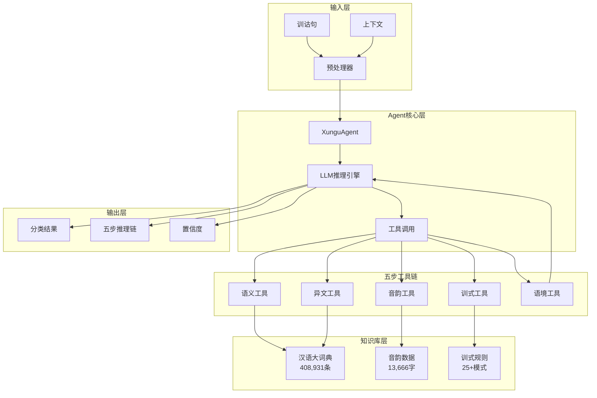
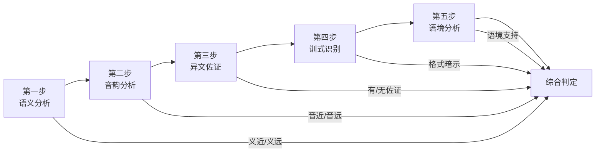

# 训诂分类系统 - 答辩材料

> 基于LLM Agent的古籍训诂类型判定系统

---

## 1. 项目概述

### 1.1 核心任务

**输入**：训诂句（如"崇，终也"）+ 上下文

**输出**：分类结果（假借说明/语义解释）+ 推理链

### 1.2 两种训释类型

```
声训法
├── 以声通义法（语义解释）
│   ├── 特点：音近义近
│   ├── 目的：揭示语源
│   └── 例："海，晦也" — 海因其色黑而晦得名
│
└── 揭明正借字法（假借说明）
    ├── 特点：音近义远
    ├── 目的：指出借字与正字
    └── 例："崇，终也" — 崇是终的借字
```

---

## 2. 系统架构

### 2.1 整体架构图



### 2.2 五步推理流程



---

## 3. 演示案例

### 案例1：假借说明 —— "崇，终也"

```
输入：
  训诂句：崇，终也
  上下文：崇朝其雨
  出处：《诗·邶风·简兮》《毛传》

五步分析：
  Step1 语义：崇(高大) vs 终(终结) → 义远
  Step2 音韵：崇/*dzruŋ/ 终/*tuŋ/ 同为東部 → 音近(叠韵)
  Step3 异文：《小雅·采绿》作"终朝" → 有佐证
  Step4 训式："A，B也"格式 → 需综合判断
  Step5 语境："高大早晨"不通，"整个早晨"通顺 → 支持假借

结果：假借说明（置信度95%）
```

### 案例2：语义解释 —— "海，晦也"

```
输入：
  训诂句：海，晦也
  上下文：海，晦也，主承秽浊，其色黑而晦也
  出处：《释名·释水》

五步分析：
  Step1 语义：海(水域) vs 晦(昏暗) → 有语义关联(颜色)
  Step2 音韵：海/*hmˤəʔ/ 晦/*m̥ˤuj/ → 音近
  Step3 异文：无假借记录
  Step4 训式："A，B也"格式，后有详解 → 声训特征
  Step5 语境：上下文明确说明"其色黑而晦" → 支持语义

结果：语义解释（置信度95%）
```

### 案例3：明确假借 —— "正，读为征"

```
输入：
  训诂句：正，读为征
  上下文：正其货贿

五步分析：
  Step4 训式："读为"是假借专用术语 → 直接判定假借

结果：假借说明（置信度98%）
```

---

## 4. 评估结果

### 4.1 核心指标

| 指标 | 数值 | 目标 |
|------|------|------|
| **准确率** | **86.67%** | >70% ✓ |
| 宏平均F1 | 84.60% | - |
| 测试样本 | 60条 | - |

### 4.2 分类别性能

```
           精确率    召回率    F1值
假借说明    71.4%    88.2%    79.0%
语义解释    94.9%    86.1%    90.2%
```

### 4.3 混淆矩阵可视化

```
                 预测
              假借    语义
        ┌─────────┬─────────┐
实  假借 │   15    │    2    │  88.2%召回
际      ├─────────┼─────────┤
    语义 │    6    │   37    │  86.1%召回
        └─────────┴─────────┘
           71.4%     94.9%    精确率
```

---

## 5. 技术亮点

### 5.1 领域知识融合

- 实现训诂学五步判断逻辑
- 25+种训式正则规则（"读为"、"犹"、"之为言"等）
- 音韵学判断（声母、韵部、叠韵双声）

### 5.2 资源高效利用

- 《汉语大词典》1.9GB数据的毫秒级检索
- 多源音韵数据整合（潘悟云+白一平-沙加尔）
- 偏移量索引实现O(1)查询

### 5.3 Agent架构

- LangChain工具调用框架
- 五个专用工具函数
- 完整推理链输出

---

## 6. 评定维度对照

| 维度 | 权重 | 完成情况 | 说明 |
|------|------|----------|------|
| 领域知识理解 | 20% | ✅ | 五步推理体现对声训法的深入理解 |
| 系统架构设计 | 20% | ✅ | Agent+工具+知识库三层架构 |
| 资源获取利用 | 20% | ✅ | 成功利用词典、音韵等多种资源 |
| 智能体实现 | 20% | ✅ | 完整的工具调用链和推理能力 |
| 识别成功率 | 20% | ✅ | 86.67%准确率，超过70%目标 |

---

## 7. 演示命令

```bash
# 单条分析
python -m src.main --input "崇，终也" --context "崇朝其雨"

# 交互模式
python -m src.main --interactive

# 运行评估
python run_evaluation.py
```

---

## 8. 项目文件结构

```
llm25/
├── src/
│   ├── agent/          # Agent核心
│   │   ├── xungu_agent.py
│   │   └── prompts.py
│   ├── tools/          # 五步工具
│   │   ├── semantic_tool.py
│   │   ├── phonology_tool.py
│   │   ├── textual_tool.py
│   │   ├── pattern_tool.py
│   │   └── context_tool.py
│   ├── evaluation/     # 评估模块
│   └── main.py
├── data/
│   ├── processed/      # 预处理数据
│   │   ├── dyhdc_index.json
│   │   └── phonology_unified.json
│   └── test/           # 测试数据集
├── docs/               # 文档
└── 《汉语大词典》结构化/  # 原始数据
```

---

## 附录：关键代码片段

### Agent核心调用

```python
from src.agent import XunguAgent

agent = XunguAgent(verbose=True)
result = agent.analyze(
    xungu_sentence="崇，终也",
    context="崇朝其雨",
    source="《毛传》"
)

print(result.classification)  # "假借说明"
print(result.confidence)      # 0.95
```

### 训式识别规则（示例）

```python
XUNSHI_PATTERNS = {
    "读为": {
        "regex": r"^(.+?)[，,]\s*读为\s*(.+?)[。？]?$",
        "type": "假借",
        "confidence": "极高",
        "direct_judge": True
    },
    "之为言": {
        "regex": r"^(.+?)之(?:为)?言\s*(.+?)也?[。？]?$",
        "type": "以声通义",
        "confidence": "高"
    }
}
```
